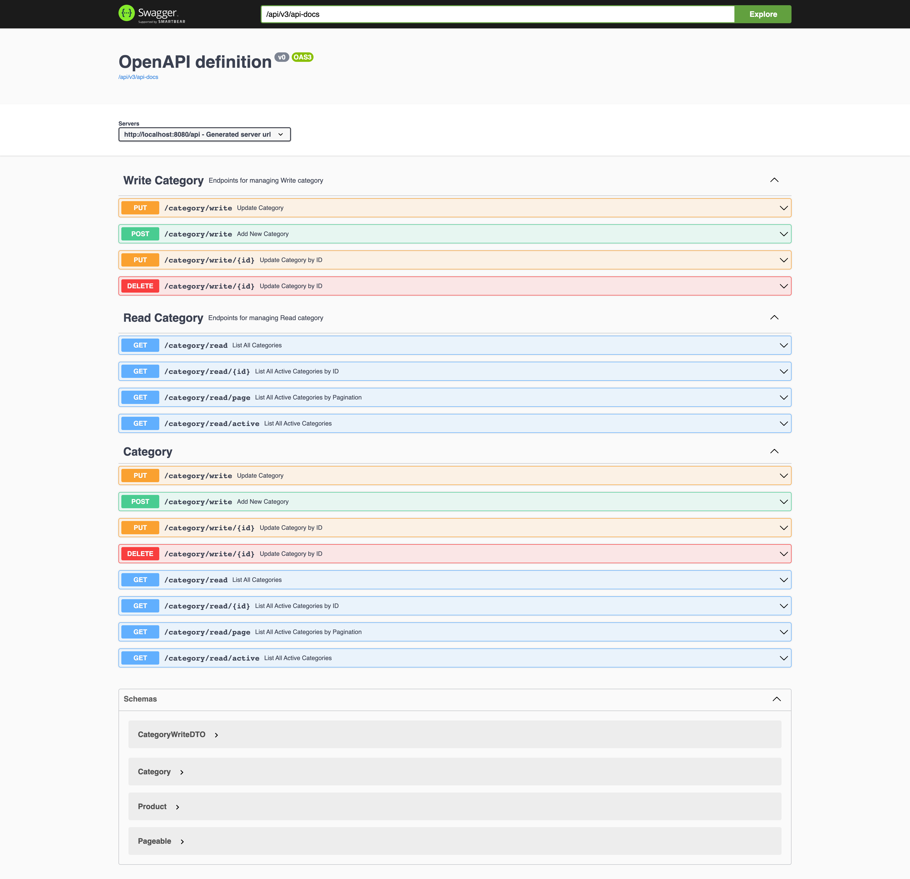

# spring-boot-cqrs-sample

# Command Query Responsibility Segregation

CQRS stands for Command Query Responsibility Segregation. its heart is the notion that you can use a different model to
update information than the model you use to read information.

For some situations, this separation can be valuable, but beware that for most systems CQRS adds risky complexity.

## CQRS Model

### Things to do list:

1. Clone this repository: `git clone https://github.com/hendisantika/spring-boot-cqrs-sample.git`
2. navigate to the folder: `cd spring-boot-cqrs-sample`
3. Replace MySQL credentials with your own in application.yml file
4. Run the application: `mvn clean spring-boot:run`
5. Open your favorite browser: http://localhost:8080/api/swagger-ui

### Image Screen shot

Swagger UI

